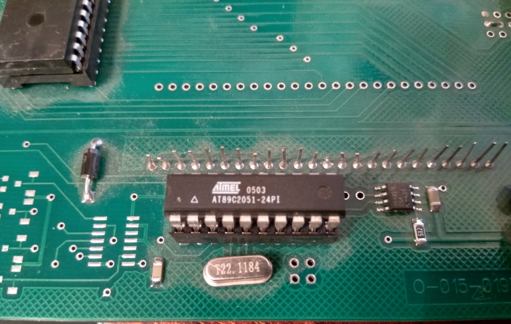

# 3 numbers
# Дисплей на 3 числа (спец проект)

###### Version: 1.0.1

## Сборка

***Примечание:*** Моему другу досталась плата
от топливораздаточной колонки (ТРК) с тремя ЖК
дисплеями по 6 цифр. Даже если вам достанется
такая же, не уверен что битовая адресация
сегментов цифр будет такой же. Выкладываю это 
именно как **спец проект** под имеющуюся
специфическую плату.

#### Для сборки такого устройства нам понадобится:

- Плата **Arduino** (любая)
- Плата от **ТРК**
- Три термодатчика
  [**DS18B20**](http://arduino-diy.com/arduino-tsifrovoy-datchik-temperatury-DS18B20 "DS18B20").
  У друга есть теплица, поэтому, думаю он
  придумает где поместить датчики для замера
  температуры.
- **Резистор 10 kOm** для фоторезистора
- **Резистор 4.7 kOm** для термодатчиков
- Соединительные **провода**
- Монтажная плата (**Breadboard**) (Можно
  обойтись без монтажной платы соединив только
  проводами, это на ваше усмотрение и в зависимости
  от конструкции которую вы придумали)
- **Светодиоды** для подсветки дисплея
- **Резисторы 220 Om** для светодиодов

#### Плата ТРК
Сама плата выглядела так:

Плата управлялась контроллером:

Перепрограммировать эту микросхему теоретически
возможно, но нужно искать программатор и потом
разбираться как это делать, поэтому я ее извлек и
подключил контакты Arduino к ее контактам.
Arduino управляет четырьмя микросхемами
[*AY0438*](doc/AY0438.pdf "LCD Driver")
которые формируют изображение на дисплеях.

#### Схема сборки

#### Получившееся устройство

## Программа

Настройки программы вы можете сделать в файле
***Settings.h***
Там можно настроить к каким контактам Arduino
что подключено.

#### Временные характеристики микросхем управления дисплеем
<table>
    <tr>
        <th>Назначение</th>
        <th>Символ</th>
        <th>Min</th>
        <th>Max</th>
        <th>Величина</th>
    </tr><tr>
        <td>Установка значения</td>
        <td align="center">tDS</td>
        <td align="right">150</td>
        <td align="right">--</td>
        <td align="center">nsec</td>
    </tr><tr>
        <td>Время хранения значения</td>
        <td align="center">tDH</td>
        <td align="right">50</td>
        <td align="right">--</td>
        <td align="center">nsec</td>
    </tr><tr>
        <td>Применение сформированого значения</td>
        <td align="center">tPW</td>
        <td align="right">175</td>
        <td align="right">--</td>
        <td align="center">nsec</td>
    </tr><tr>
        <td>Ожидание следующего значения</td>
        <td align="center">tPD</td>
        <td align="right">--</td>
        <td align="right">500</td>
        <td align="center">nsec</td>
    </tr>
</table>

#### Формирование значений
Для формирования знаков на дисплее нужно
просуммировать шестнадцатеричные номера нужных
сегментов. Номера приведены на рисунке:

